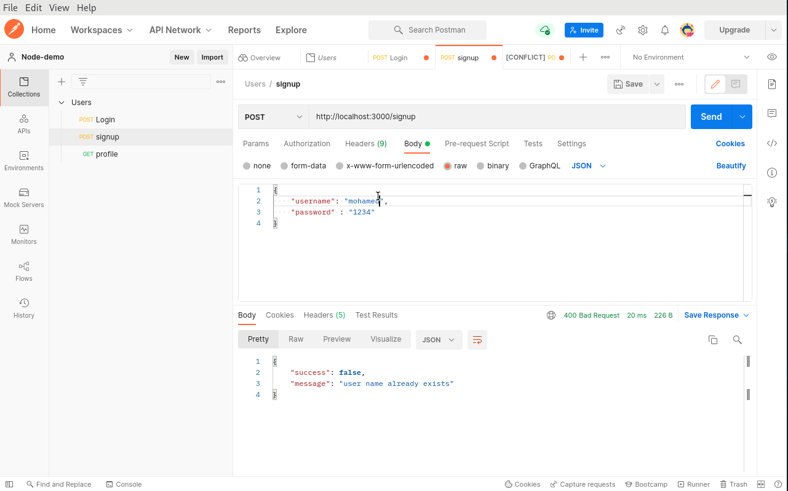

# NATIVE Node WEB API DEMO

This is a solution of creating basic CRUD operation using node js

## Table of contents

- [Overview](#overview)
    - [Screenshot](#screenshot)
- [My process](#my-process)
    - [Built with](#built-with)
    - [Libraries](#Libraries)
- [Author](#authors)

## Overview

### GIF




<p align="right">(<a href="#top">back to top</a>)</p>

## My process
1) Clone the project

   ``` https://github.com/MohamedEldefrawy/node-webservice-demo.git```
2) install [node](https://nodejs.org/en/download/)
3) in the project directory run the following
    ```
    node maهn.mjs
    ```
<p align="right">(<a href="#top">back to top</a>)</p>

### Built with

* [Node JS](https://nodejs.org/en/download/)
* [JS](https://www.javascript.com/)

<p align="right">(<a href="#top">back to top</a>)</p>

## Authors


* LinkedIn - [Mohamed Eldefrawy](https://www.linkedin.com/in/mohamedeldefrawy)

<p align="right">(<a href="#top">back to top</a>)</p>
